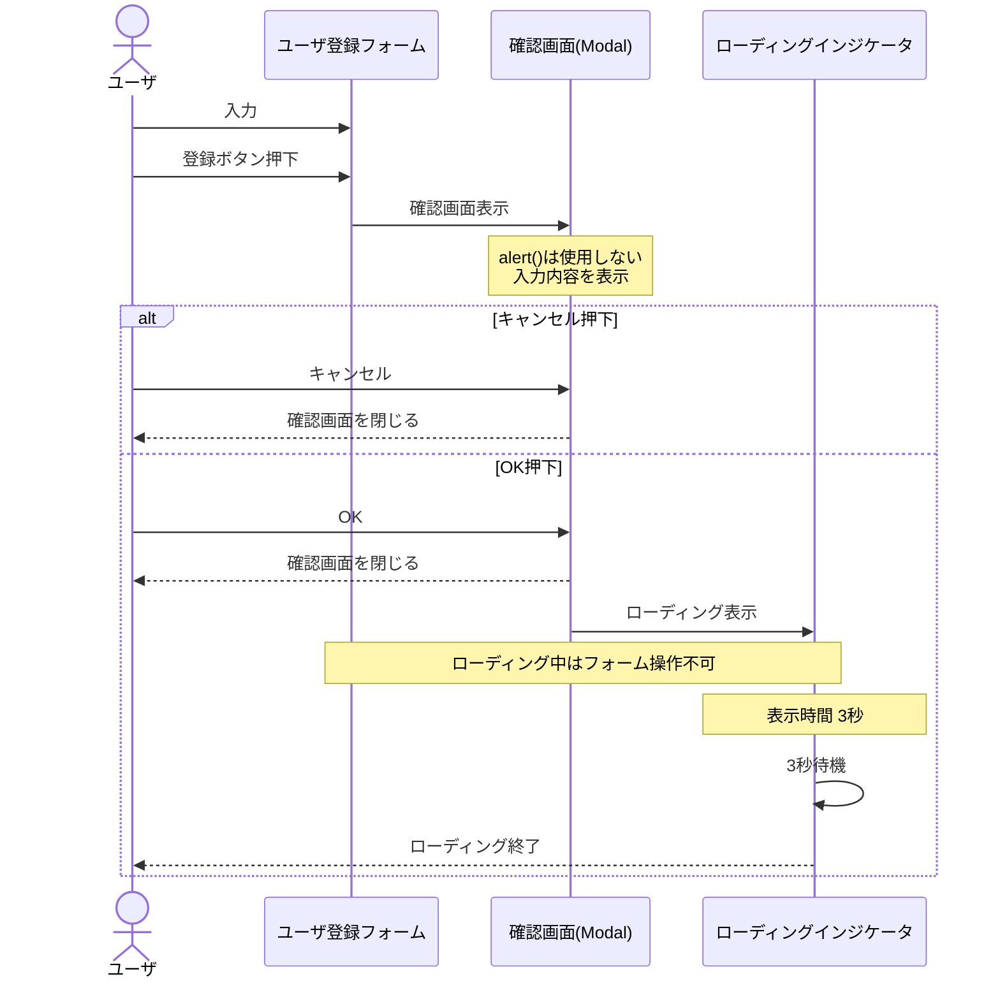

# フロントエンド学習用 課題

## 注意点

* 学んでから手を動かすではなく、手を動かして分からないところを調べるというスタンスで進めてください。
* CopilotChatやGitHubCopilotの利用は最小限にしてください。（周辺知識が漏れるため）

## 学習課題

* フォーム
* Bootstrap
* バリデーション
* ポップアップ画面
* ローディングインジケータ
* REST API連携

## ❓課題.1 ユーザ登録フォーム画面を作成してください( 1 Week )

### 事前学習

* [HTML/CSS入門 (動画)](https://www.linkedin.com/learning/learning-html-and-css-2023/4513423?contextUrn=urn%3Ali%3AlyndaLearningPath%3A5eeb2667498e3c50bbdfe904&u=187578513)
* [Bootstrap（リファレンス）](https://getbootstrap.jp/docs/5.3/getting-started/introduction)

### 参考

* [Uiverse](https://uiverse.io/)
* [CSSフレームワーク「Bootstrap」超入門(Zenn記事)](https://zenn.dev/yamap_web/articles/a2d4d213d4eb48)

### ファイル

* ファイル名は `index.html` とする。  
* Bootstrapを配置する場合は、assets/libs配下とする。  
* css は assets/css 配下とする。

### 画面実装制約

本画面は **Bootstrapを利用して実装し**、独自CSSの作成は最小限とする。  
Bootstrapの利用方法は以下のいずれかとする。

* CDN経由で読み込む
* ローカル配置したBootstrapファイルを読み込む

※ バージョンは自由です。

#### CDN利用例

```html
https://cdn.jsdelivr.net/npm/bootstrap@5.3.3/dist/css/bootstrap.min.css
```

### ユーザ登録フォーム仕様

#### 1. 概要

社員情報を登録するためのフォームを提供する。

#### 2. 入力項目

#### 2.1 社員名

| 項目 | 内容 |
| -------- | -------- |
| 項目名 | 社員名 |
| 入力形式 | テキストボックス |
| 初期値 | 空文字 |

---

### 2.2 誕生日

| 項目 | 内容 |
| -------- | -------- |
| 項目名 | 誕生日 |
| 入力形式 | 日付 |

---

### 2.3 年齢

| 項目 | 内容 |
| -------- | -------- |
| 項目名 | 年齢 |
| 入力形式 | 数値 |
| 必須 | 必須 |

---

### 2.4 部門

| 項目 | 内容 |
| -------- | -------- |
| 項目名 | 部門 |
| 入力形式 | プルダウン |

**選択肢**  

* なし
* A部門
* B部門
* C部門

---

### 2.5 関連部門

| 項目 | 内容 |
| -------- | -------- |
| 項目名 | 関連部門 |
| 入力形式 | 複数選択 |

**選択肢**  

* A部門
* B部門
* C部門

---

### 2.6 連絡可

| 項目 | 内容 |
| -------- | -------- |
| 項目名 | 連絡可 |
| 入力形式 | チェックボックス |
| 初期値 | false |

---

### 2.7 性別

| 項目 | 内容 |
| -------- | -------- |
| 項目名 | 性別 |
| 入力形式 | ラジオボタン |

**選択肢**  

* 男性
* 女性
* その他

---

### 2.8 備考

| 項目 | 内容 |
| -------- | -------- |
| 項目名 | 備考 |
| 入力形式 | テキストエリア |

---

### 2.9 ファイルアップロード

| 項目 | 内容 |
| -------- | -------- |
| 項目名 | ファイルアップロード |
| 入力形式 | ファイル選択 |

---

### 2.10 登録ボタン

| 項目 | 内容 |
| -------- | -------- |
| 項目名 | 登録ボタン |
| 入力形式 | ボタン |

---

### 2.11 キャンセルボタン

| 項目 | 内容 |
| -------- | -------- |
| 項目名 | 削除ボタン |
| 入力形式 | ボタン |

## ❓課題.2 ユーザ登録フォームにバリデーションとキャンセル機能を実装してください( 1 Week )

### 事前学習

* [JavaScript基本講座 (動画)](https://www.linkedin.com/learning/javascript-essential-training-2024/5964033?contextUrn=urn%3Ali%3AlyndaLearningPath%3A5eeb2667498e3c50bbdfe904&u=187578513)

### 参考

* [MDN - JavaScript](https://developer.mozilla.org/ja/docs/Web/JavaScript)
* [とほほの JavaScript入門](https://www.tohoho-web.com/js/)

課題.1のフォームににバリデーションを実装してください。  
また、ユーザが入力に迷わない適切なメッセージを表示してください。  
キャンセルボタン押下時に、使用に合わせた初期化を行ってください。  
JavaScriptはES6以降を前提として記述してください。  

### ファイル

* JavaScriptは assets/js 配下に配置する。
* 対象のページのみを主としたJavaScriptでかつ  
  コード量が数行程度のものであれば index.htmlに記述するのも可。

### エラーメッセージの表示タイミング

エラーメッセージの表示は、以下のいずれかの場合に表示される事とします。

* 登録ボタン押下時
* 入力中
* フォーカスが外れた時

---

### 1 社員名

| 項目 | 内容 |
| -------- | -------- |
| 必須 | 必須 |
| 最大文字数 | 20文字 |

**バリデーション**  

* 未入力不可
* 20文字以内

---

### 2 誕生日

| 項目 | 内容 |
| -------- | -------- |
| 必須 | 必須 |

**バリデーション**  

* 未入力不可
* 未来の誕生日不可

---

### 3 年齢

| 項目 | 内容 |
| -------- | -------- |
| 必須 | 必須 |

**バリデーション**  

* 未入力不可
* 数値のみ
* 0以上

---

### 4 年齢

| 項目 | 内容 |
| -------- | -------- |
| 必須 | 必須 |

**バリデーション**  

* なし、未選択は不可

---

### 5 関連部門

| 項目 | 内容 |
| -------- | -------- |
| 必須 | 必須 |

**バリデーション**  

* 1件以上選択必須

---

### 6 連絡可

| 項目 | 内容 |
| -------- | -------- |
| 必須 | 任意 |

---

### 7 性別

| 項目 | 内容 |
| -------- | -------- |
| 必須 | 必須 |

**バリデーション**  

* 未選択不可

---

### 8 備考

| 項目 | 内容 |
| -------- | -------- |
| 必須 | 任意 |

---

### 9 ファイルアップロード

| 項目 | 内容 |
| -------- | -------- |
| 必須 | 必須 |

**バリデーション**  

* ファイル未選択不可
* ファイルサイズ10KB以下
* 拡張子txtのみ

## ❓課題.3 ユーザ登録フォームに確認画面とローディングインジケータを実装してください( 1 Week )

ユーザ登録フォームに確認画面とローディングインジケータを以下の仕様を満たすように実装してください。

### 確認画面仕様

* 登録ボタン押下時にポップアップ表示されるものとする
* JavaScriptのalert()は使用しない
* フォームの入力内容をポップアップされた確認画面で確認できることとする
* OKとキャンセルボタンを実装し、両方とも押下時はポップアップを閉じることとする

### ローディングインジケータ仕様

* 確認画面のOKボタン押下時に表示されることとする
* 表示時間は3秒間とする
* ローディングインジケータ表示中は、ユーザ登録フォームと確認画面の操作ができない事とする



## ❓課題.4 JsonPlaceHolder を利用した REST API 実装( 1 Week )

### 参考

* [初心者でも安心！REST APIの基礎と実践的な使い方(Qiita記事)](https://qiita.com/inokage/items/fae28aea3d6710d7baca)

---

[JsonPlaceHolder](https://jsonplaceholder.typicode.com/) を利用して、  
REST API の基本操作（GET、POST、PUT、PATCH、DELETE）を実装してください。

ユーザ登録フォームの登録ボタンの下にこの課題の実装を行う事。  
各処理は画面上のボタン押下で実行し、APIレスポンスを画面に表示すること。

* Fetch API を利用すること
* 処理ごとに関数を分けること

### 表示について

取得結果は以下のいずれかで表示する。
HTTPステータスは必ず表示すること。

* テーブル表示
* JSON整形表示
  
  ```json
  <pre>
  {
    "id": 1,
    "title": "設備規程"
  }
  </pre>
  ```

---

### 1.単体取得

ボタン押下でIDが1のデータを取得し、HTTPステータスと一緒に画面に表示してください。  

**API**  

```http
GET https://jsonplaceholder.typicode.com/posts/{id}
```

---

### 2.一覧取得

ボタン押下で一覧データを取得し、一覧データをテーブル形式で表示し、HTTPステータスも表示してください。

**API**  

```http
GET https://jsonplaceholder.typicode.com/posts
```

---

### 3.新規登録

以下の内容を登録し、登録後のレスポンスをHTTPステータスと一緒に画面に表示してください。  
JSONPでもJSONでも文字列でも構いません。  
IDは自動付与されないので、101としてください。

**API**  

```http
POST https://jsonplaceholder.typicode.com/posts
```

**登録データ**  

Content-Type: application/json

title : 設備規程  
body  : 設備Gr向け規程  
userId: 1,  
id : 101

---

### 4.更新

ボタン押下でIDが1のデータを更新し、更新後のレスポンスをHTTPステータスと一緒に画面に表示してください。

**API**  

```http
PUT https://jsonplaceholder.typicode.com/posts/{id}
```

**登録データ**  

Content-Type: application/json

title : 設備規程（改訂）  
body  : 改訂版  
userId: 1,  
id : 1

---

### 5.部分更新

ボタン押下でIDが１のデータを更新し、更新後のレスポンスをHTTPステータスと一緒に画面に表示してください。

```http
PATCH https://jsonplaceholder.typicode.com/posts/{id}
```

**登録データ**  

Content-Type: application/json

title : 設備規程（部分更新）  

---

### 6.削除

ボタン押下でIDが1のアイテムを削除し、削除後のHTTPステータスを画面に表示してください。

```http
DELETE https://jsonplaceholder.typicode.com/posts/{id}
```
